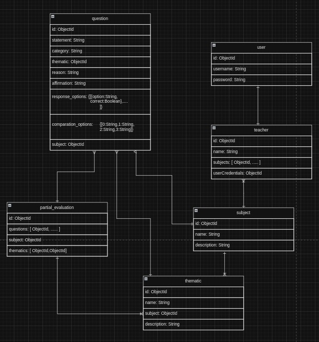

# Básico en MongoDB


## Operaciones Básicas en MongoDB


- Creacion de base de datos MongoDB:

    ```bash
     use tiendaTelefonos
    ```

- Creación de una base de datos:

    ```bash
     db.createCollection("telefonos")
    ```

- Inserción de datos:

    ```bash
     db.telefonos.insert({ modelo: "iPhone 13", marca: "Apple", almacenamiento: 128, precio: 999.99 })
     db.telefonos.insert({ modelo: "Galaxy S21", marca: "Samsung", almacenamiento: 256, precio: 899.99 })

    ```

    O utilizando insertMany para insertar varios documentos a la vez:

    ```bash
        db.telefonos.insertMany([
        { modelo: "Pixel 6", marca: "Google", almacenamiento: 128, precio: 799.99 },
        { modelo: "OnePlus 9", marca: "OnePlus", almacenamiento: 256, precio: 899.99 }
        ])
    ```

- Consulta de datos:

    ```bash
     ddb.telefonos.find()

    ```


- También puedes realizar consultas más específicas:

    ```bash
     db.telefonos.find({ marca: "Apple" })
    ```


- Actualización de datos:

    ```bash
     // Actualizar el precio del iPhone 13
    db.telefonos.update({ modelo: "iPhone 13" }, { $set: { precio: 1099.99 } })

    ```

    - updateOne:
        ```bash
        // Actualizar el precio del iPhone 13 utilizando updateOne
         db.telefonos.updateOne({ modelo: "iPhone 13" }, { $set: { precio: 1099.99 } })

        ```

    - updateMany:
        ```bash
         // Actualizar el almacenamiento de todos los teléfonos a 512 GB
         db.telefonos.updateMany({}, { $set: { almacenamiento: 512 } })

        ```

- Eliminación de datos:

    ```bash
     // Eliminar el Galaxy S21
     db.telefonos.remove({ modelo: "Galaxy S21" })

    ```

    - deleteOne: 
        ```bash
         // Eliminar un modelo específico utilizando deleteOne
         db.telefonos.deleteOne({ modelo: "Pixel 6" })

        ```

    - deleteMany: 
        ```bash
         // Eliminar todos los teléfonos con un precio menor a 900.0
         db.telefonos.deleteMany({ precio: { $lt: 900.0 } })

        ```
- Índices:

    ```bash
     // Crear un índice en el campo 'modelo'
     db.telefonos.createIndex({ modelo: 1 })
    ```

Este ejemplo proporciona comandos básicos de MongoDB para realizar operaciones comunes en una base de datos de una tienda de teléfonos.

# Aplicación parciales
## Explicación de caso de uso

*El contexto de aplicación gira en torno al desarrollo de un sistema generador de exámenes parciales. Este proyecto surge como resultado de la automatización del proceso de creación de evaluaciones parciales destinadas a profesores. La finalidad de este innovador sistema es simplificar y acelerar la labor docente al proporcionar una herramienta eficaz y personalizable. Esta herramienta permitirá la generación rápida y precisa de exámenes parciales, optimizando así el tiempo dedicado a la preparación de material evaluativo. Con esta solución automatizada, los educadores pueden dirigir su energía hacia actividades pedagógicas más significativas. Al mismo tiempo, se asegura la calidad y relevancia de los exámenes parciales utilizados para evaluar el desempeño académico de los estudiantes.*




Crear y ver las datos de las tablas

[](https://asciinema.org/a/TzIYA6JzWQOL6lVJmhv4jptNH)


