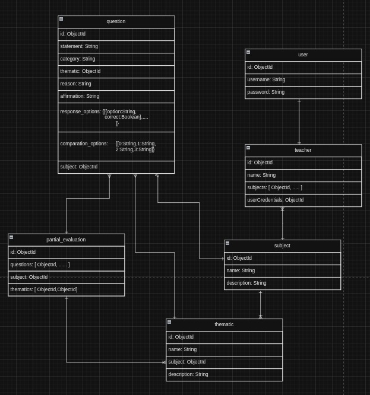

# Básico en Redis
## Operaciones Básicas en Redis

### Strings (SET y GET):

- Actualizar información de un artículo en venta:

  ```bash
  SET producto:1 "Zapatos deportivos Nike"
  GETSET producto:1 "Zapatos de moda Puma"  # Actualizar el valor y obtener el anterior
  ```

- Eliminar:

  ```bash
   DEL producto:1
  ```

### Listas (RPUSH, LRANGE, LPOP):

- Actualizar:

  ```bash
   RPUSH ofertas "Televisor Samsung"
   RPUSH ofertas "Laptop HP"
   LSET ofertas 0 "Smartphone Apple"  #   Actualizar el primer elemento
  ```

- Eliminar:

  ```bash
   LPOP ofertas  # Eliminar el primer elemento de las ofertas

  ```

### Conjuntos (SADD, SMEMBERS, SREM):

- Actualizar:

  ```bash
   SADD tiendas "ElectroMart"
   SADD tiendas "FashionZone"
  ```

- Eliminar:
  ```bash
   SREM tiendas "FashionZone"  # Eliminar una tienda del conjunto
   DEL tiendas  # Eliminar todas las tiendas
  ```

### Hashes (HSET, HGET, HDEL):

- Actualizar:

  ```bash
   HSET tienda:1 nombre "ElectroMart" categoria "Electrónicos" ubicacion "Planta baja"
   HSET tienda:1 ubicacion "Segundo piso"  # Actualizar la ubicación de la tienda
  ```

- Eliminar:

  ```bash
   HDEL tienda:1 categoria  # Eliminar la categoría de la tienda
  ```

### Publicación/Suscripción (PUBLISH y UNSUBSCRIBE):

- Actualizar:

  ```bash
   PUBLISH noticias_centro_comercial "¡Gran venta de fin de semana en todas las tiendas!"
  ```

- Eliminar:
  ```bash
   UNSUBSCRIBE noticias_centro_comercial  # Dejar de recibir noticias
  ```

Este ejemplo utiliza los mismos conceptos de Strings, Listas, Conjuntos, Hashes y Publicación/Suscripción de Redis, pero aplicados a un contexto de centro comercial. Puedes ajustar los nombres de las claves y los datos según las necesidades específicas de tu aplicación.

# Aplicación parciales
## Explicación de caso de uso

*El contexto de aplicación gira en torno al desarrollo de un sistema generador de exámenes parciales. Este proyecto surge como resultado de la automatización del proceso de creación de evaluaciones parciales destinadas a profesores. La finalidad de este innovador sistema es simplificar y acelerar la labor docente al proporcionar una herramienta eficaz y personalizable. Esta herramienta permitirá la generación rápida y precisa de exámenes parciales, optimizando así el tiempo dedicado a la preparación de material evaluativo. Con esta solución automatizada, los educadores pueden dirigir su energía hacia actividades pedagógicas más significativas. Al mismo tiempo, se asegura la calidad y relevancia de los exámenes parciales utilizados para evaluar el desempeño académico de los estudiantes.*




Crear y ver las datos de las tablas

[](https://asciinema.org/a/kiZBGnz4CRuYPEvYpVVW1MLzs)